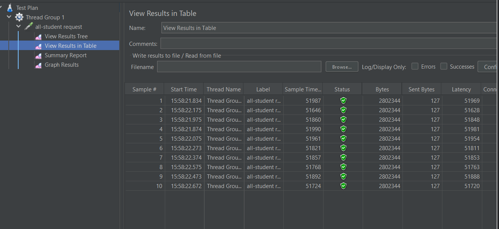
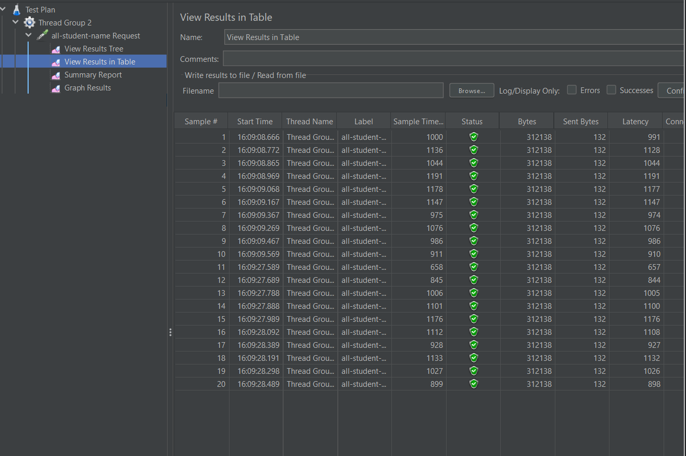
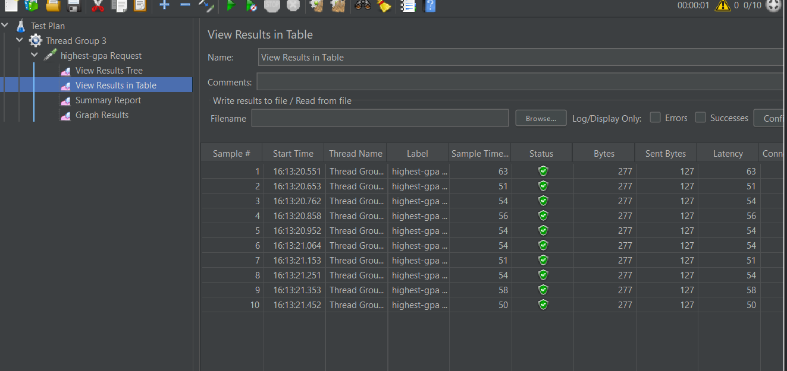
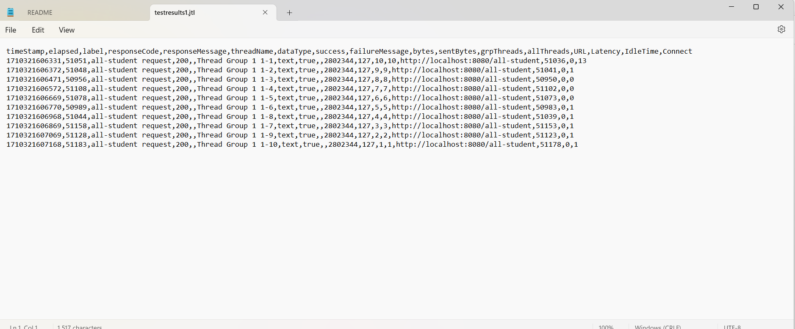
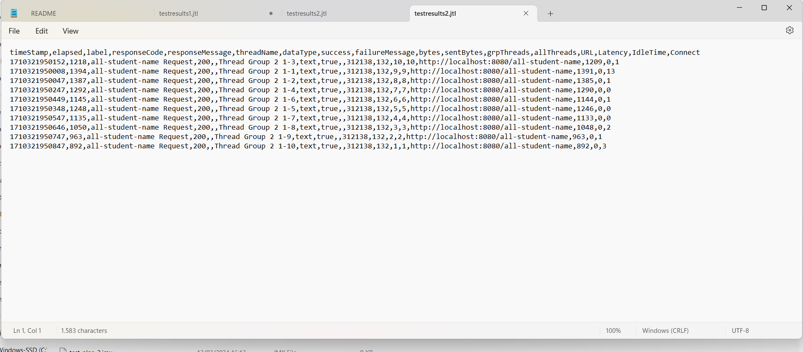
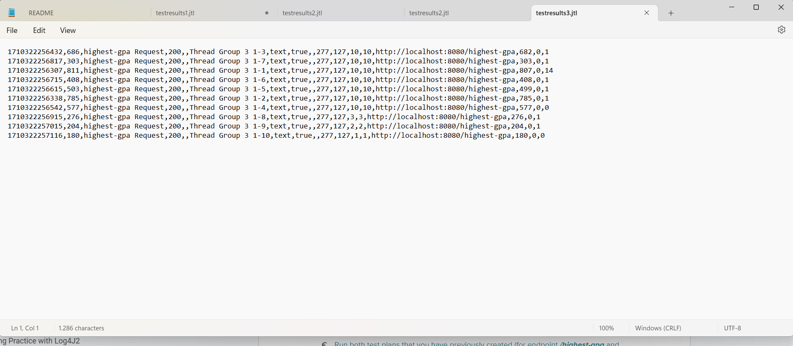
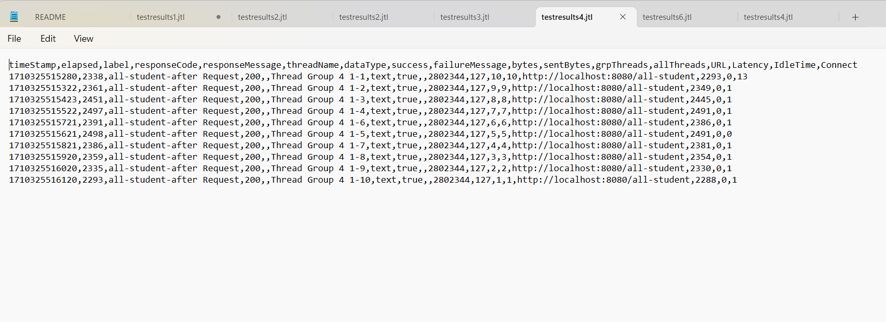
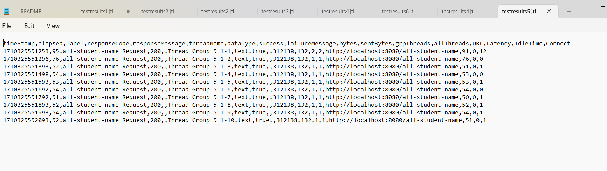
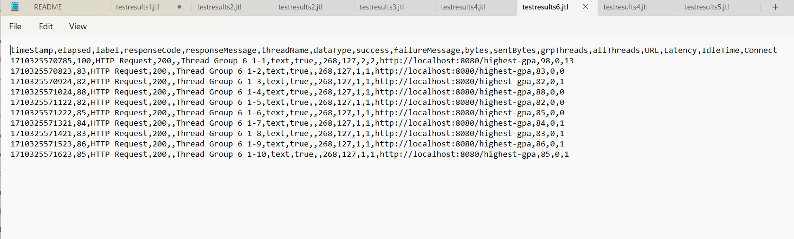

Hasil Jmeter GUI sebelum profiling

Hasil JMeter CLI

Hasil JMeter setelah profiling

kecepatan request kedua implementasi terlihat jauh berbeda.  Kesimpulannya adalah optimisasi implementasi method akan sangat berpengaruh pada pengujian kecepatan aplikasi.